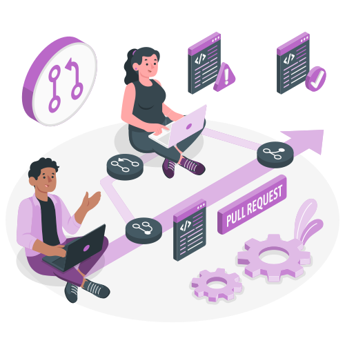

# Frontend Lab

  

Hi there, we're glad to congratulate you on passing interview and becoming much closer to be a real frontend dev.

### What is the place?

It's the repository on which you will find the bunch of tasks on HTML, CSS, JS and React. It should helps you to dive into the frontend dev world and become more familiar with it. The workflow (tasks which have to be made / can be skipped) will be defined by your mentor.

### What will you face with?

- the process of creating responsive landing page
- js-tasks covering a lot of topics
- digging into React development by creating your own app

So, if you're ready to work hard, go to [Getting Started] (./tasks/getting_started.md)

## Progress

- [x] [Info](#frontend-lab)
- [ ] [Getting Started](./tasks/getting_started.md)
- [ ] [Some task here]
- [ ] [Some task here]
- [ ] [Some task here]
- [ ] [React project](./tasks/react_project.md)
