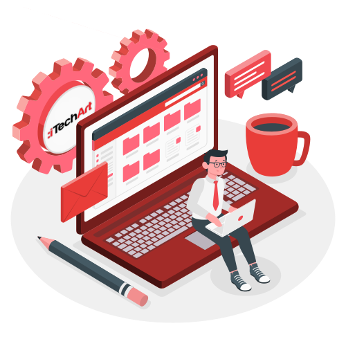

# Frontend Lab

  

Hi there, we're glad to congratulate you 🎉 on passing interview and becoming much closer to be a real frontend dev.

### What is the place?

It's the repository on which you will find the bunch of tasks on HTML, CSS, JS and React. It should help you to dive into the frontend dev world and become more familiar with it. The workflow (tasks which have to be made / can be skipped) will be defined by your mentor.

### What will you face with?

- the process of creating responsive landing page
- js-tasks covering a lot of topics
- digging into web development by creating your own app

So, if you're ready to work hard, go to [Getting Started](./materials/getting_started.md)

## Progress

- [x] [Info](#frontend-lab)
- [x] [Getting Started](./materials/getting_started.md)
- [ ] [Landing Page](./materials/landing_page.md)
- [ ] [Landing Page - Working With Third-Party Services](./materials/landing_page_with_data.md)
- [ ] [Javascript - Custom Moment.js](./materials/js/custom_moment_js.md)
- [ ] [Javascript - Cacher](./materials/js/cacher.md)
- [ ] [Javascript - Tabs](./materials/js/tabs.md)
- [ ] [Javascript - JSON Visualizer](./materials/js/json_visualizer.md)
- [ ] [Javascript - Asynchronous](./materials/js/asynchronous.md)
- [ ] [Package managers and build tools](./materials/build-tools.md)
- [ ] [React Project](./materials/react)

🔮 PS: following [this link](./materials/useful_links.md) you can find a bunch of useful links
