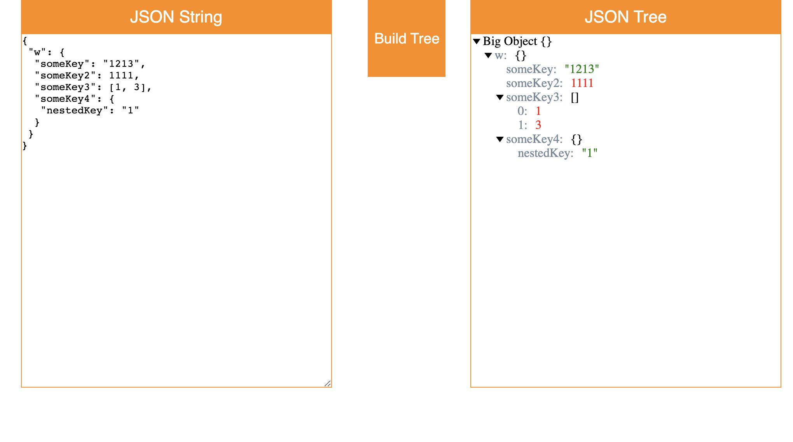

# JSON visualizer

Create an HTML page split in two parts. The left side is a text area for entering JSON data + "Build tree data" button. 
The right side is the area for displaying the resulting JSON tree.
The [example](https://jsoneditoronline.org/) (and you can find billion of other ones)

## Requirements

- Input text validation. The error message should be displayed in the page if the text isn't valid JSON
- Objects and arrays should be interactive - they can be collapsed / expanded (as in example)
- If value is object/array show {} or [] after key (when value is collapsed and expanded)
- Field type indication (e.g. numbers are red, strings are blue ...)
- It would be great if you add some styles to make it not ugly one 👹🤢

Your renderer might look something like this:

  

### 👇 Maybe it'll help you 👇:

☘️ To solve this task you should create a recursive function (if you don't know what is it, [read here](https://learn.javascript.ru/recursion))
