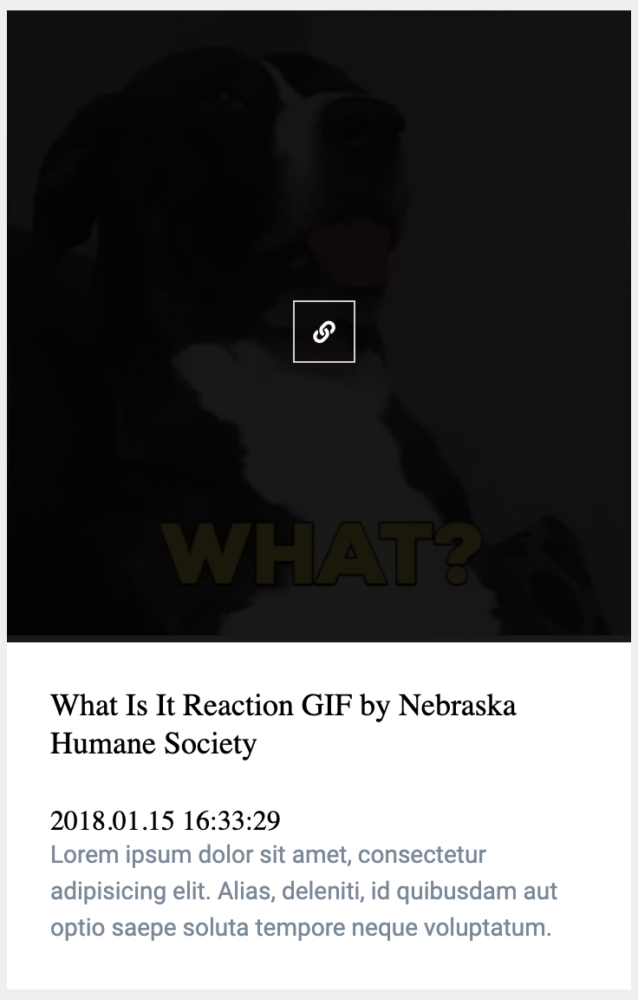

# Lets Alive You Landing Page

Continue working on `workflow/landing-page` folder.

In the landing page from the [privious task](./landing_page.md) we have section <em>AND HERE ARE SOME IMAGES FOR YOU..</em> where show static images inserted in HTML so cards in this section have to be changed. Now you have to implement dynamic content loading - load GIFs and the data about them.

### Requirements:

- Use [GIPHY API](https://developers.giphy.com/docs/api/) to get GIFs
- Choose what category of GIFs you will display (for ex: dogs/cats/memes/etc.)
- The card have to contain: GIF, name, the date of uploading, by hovering the GIF user can press the link and open GIF on the giphy website

  
  

- At the bottom of cards section you have to implement pagination (the QIPHY support it). User should see N cards (for ex: 10 first cards), to see next 10 - click to ➡️ button, previous ⬅️ 10 cards.
- For AJAX-requsts use [fetch method](https://learn.javascript.ru/fetch)

### 👇 Maybe it'll help you 👇:

☘️ Use QIPHY search endpoint 🤫 
☘️ Read what is [Promise](https://learn.javascript.ru/promise) if you don't understand well 
☘️ [Async/await functions](https://learn.javascript.ru/async-await) 

Have a look what you should [do next](../README.md#progress). 👀
